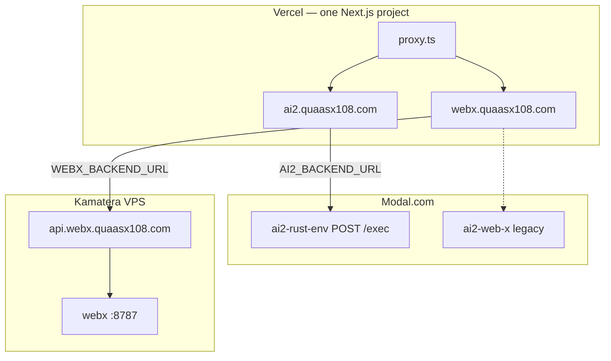

# AI² + Web-X — Production Architecture

> **For agents:** Read this before changing deploy, routing, env vars, or cross-product links.  
> Classical corpus / chat RAG rules: workspace [`AGENTS.md`](../AGENTS.md) and `/data/LIBRARY.md` (local monorepo).

---

## TL;DR

| Product | Public URL | Frontend host | Backend host | Backend runtime |
|---------|------------|---------------|--------------|-----------------|
| **AI² Chat** | `https://ai2.quaasx108.com` | Vercel (this repo) | Modal + Kamatera Linga (by tier) | See three-tier table below |
| **Web-X Search** | `https://webx.quaasx108.com` | Vercel (same project) | Kamatera VPS | Always-on FastAPI on `api.webx.quaasx108.com` |
| **Web-X API** | `https://api.webx.quaasx108.com` | — | Kamatera `74.113.234.141` | Caddy → `127.0.0.1:8787` |

### Chat tiers

| Tier | Slug | Pipeline |
|------|------|----------|
| Patient (Low) | `ai2-ayu-flash` | Kamatera Scrapling + `deepseek/deepseek-v3.2` (effort=low) |
| Scholar (Medium) | `ai2-ayu-pro` | Parallel Modal V3.2 DB + Kamatera Scrapling → V3.2 merge |
| Clinician (Extra high) | `ai2-ayu-max` | Modal `stepfun/step-3.5-flash` library-only (effort=high) |
| GOD (Maximum) | `ai2-ayu-god` | Modal `deepseek/deepseek-v4-pro` library-only (effort=xhigh) |

Router: `lib/ai2/rustenv-exec.ts` → `runChatPipeline`. Env: `AI2_BACKEND_URL`, `WEBX_BACKEND_URL`, `AI2_WEBX_BRIDGE_SECRET`.

**This Git repo:** [`github.com/radio335678-star/quaasx`](https://github.com/radio335678-star/quaasx) — root = `frontend/`  
**Sibling on disk (not in git):** `../backend/` (Modal + Kamatera deploy), `../data/` (corpus DB)

Full copy with workspace paths: [`../ARCHITECTURE.md`](../ARCHITECTURE.md)

---

## Workspace layout

```
frontend/                    ← YOU ARE HERE (git root, Vercel deploy)
├── proxy.ts                 ← webx vs ai2 host routing + auth
├── ARCHITECTURE.md          ← this file
├── PRODUCTION.md            ← AI² Modal deploy checklist
├── app/
│   ├── (chat)/              ← AI² → ai2.quaasx108.com/app
│   ├── (webx)/app/web-x     ← Web-X → webx.quaasx108.com
│   └── api/
│       ├── chat/            → Modal ai2-rust-env
│       └── webx/            → Kamatera api.webx
├── components/web-x/        ← WebXShell
├── public/web-x/            ← webx-app.js, webx.css
└── lib/
    ├── webx-backend.ts
    └── webx-public.ts

../backend/                  ← NOT in git — deploy separately
├── deploy_ai2_rustenv.py    → Modal AI² chat
├── deploy_ai2_webx.py       → Modal Web-X (legacy)
├── webx_app.py / webx_engine.py
└── kamatera/                → VPS deploy scripts
```

---

## Request flow



---

## AI² Chat

| Frontend | Backend |
|----------|---------|
| `app/(chat)/api/chat/route.ts` | Modal `https://quaasx--ai2-rust-env-rustenvgateway-web.modal.run` |
| `lib/ai2/rustenv-exec.ts` → `POST /exec` | Runs `agent_run.py`; OpenRouter key in Modal secret `openrouter-key` |
| `app/(chat)/api/warmup/route.ts` → `/health` | Idle scale-down ~180s |

**Vercel:** `AI2_BACKEND_URL`, `AUTH_SECRET`  
**Deploy backend:** `python -m modal deploy backend/deploy_ai2_rustenv.py` (from local monorepo root)

Web-X entry from chat: `components/chat/modality-picker.tsx` → external `WEBX_PUBLIC_URL` (not embedded).

---

## Web-X Search

| Layer | Detail |
|-------|--------|
| UI | `components/web-x/webx-shell.tsx` + `public/web-x/webx-app.js` |
| Vercel proxy | `app/api/webx/search|warmup|config/route.ts` |
| API (prod) | Kamatera `https://api.webx.quaasx108.com` |
| Auth | Header `X-WebX-Secret` = Vercel `WEBX_API_SECRET` = server `/opt/webx/.env` |

**Browser never calls Kamatera directly** — only same-origin `/api/webx/*`.

**Deploy API:** `../backend/kamatera/deploy.ps1 -SshHost webx-kamatera`  
**Modal fallback:** `../backend/deploy_ai2_webx.py` (legacy)

---

## Vercel env (Production)

```env
AI2_BACKEND_URL=https://quaasx--ai2-rust-env-rustenvgateway-web.modal.run
AUTH_SECRET=<random>

NEXT_PUBLIC_AI2_URL=https://ai2.quaasx108.com
NEXT_PUBLIC_WEBX_URL=https://webx.quaasx108.com
WEBX_PUBLIC_HOST=webx.quaasx108.com

WEBX_BACKEND_URL=https://api.webx.quaasx108.com
WEBX_API_SECRET=<matches Kamatera>
```

**Domains:** add `ai2.quaasx108.com` and `webx.quaasx108.com` to one Vercel project.

**Deploy:** `git push origin main`

---

## DNS

| Record | Target |
|--------|--------|
| `ai2`, `webx` | Vercel |
| `api.webx` | A → `74.113.234.141` |

---

## Host routing (`proxy.ts`)

- `webx.quaasx108.com/` → rewrite `/app/web-x`
- `webx.quaasx108.com/app/*` → redirect to `ai2.quaasx108.com`
- `ai2.quaasx108.com/app/web-x` → redirect to `webx.quaasx108.com`
- `/api/chat`, `/api/webx/*` → public (no auth)

Next.js 16: use **`proxy.ts` only** — do not add `middleware.ts`.

---

## Common fixes

| Issue | Fix |
|-------|-----|
| Web-X 503 | Set `WEBX_BACKEND_URL` to Kamatera HTTPS URL |
| Web-X 422 | Proxy must send `Content-Type: application/json` |
| Web-X 401 | Sync `WEBX_API_SECRET` Vercel ↔ Kamatera |
| AI² slow first reply | Modal cold start; `/api/warmup` |
| Tabs stuck | `webx-app.js` `searchSeq` + abort stale searches |
| AI² web prefetch skipped | Set Kamatera + Modal `AI2_WEBX_BRIDGE_SECRET` (`webx-bridge`) |

**Private bridge:** Modal `agent_run.py` → Kamatera `/api/internal/agent/scrape` → `/data/webx_cache/` → sufficiency router. See root `ARCHITECTURE.md`.

---

## Agent checklist

1. UI / routing → this repo, `git push`
2. AI² agent → Modal `deploy_ai2_rustenv.py`
3. Web-X SERP/AI Mode → `../backend/webx_engine.py` + Kamatera deploy
4. Private web bridge → internal Kamatera routes + Modal `webx-bridge` secret (not Vercel)
5. Citations → query `../data/ai2_unified.db` per `AGENTS.md`

*Last updated: 2026-07-21*
